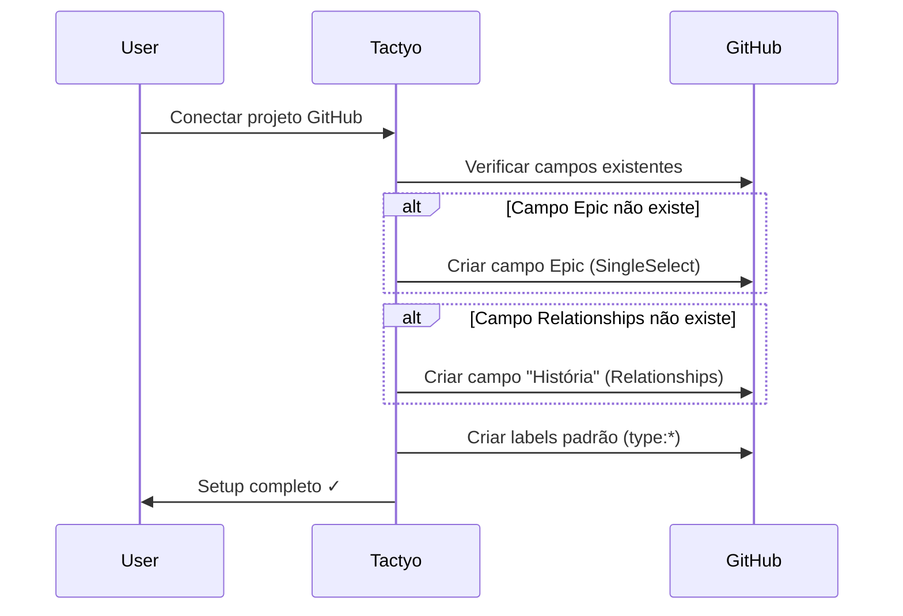
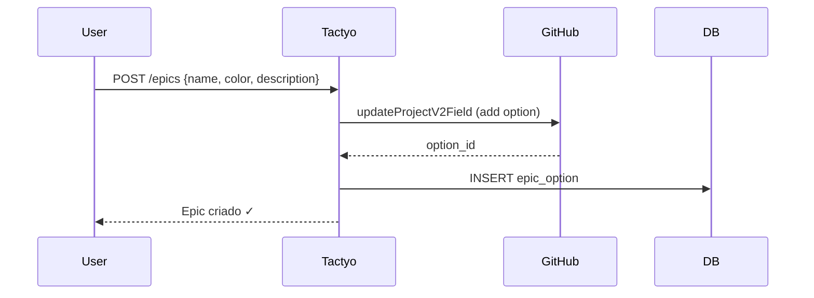
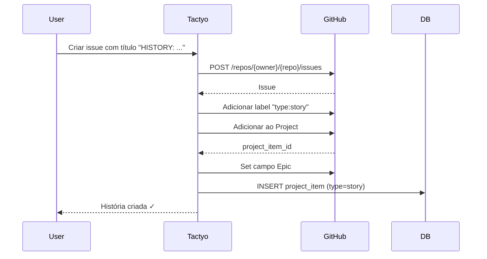
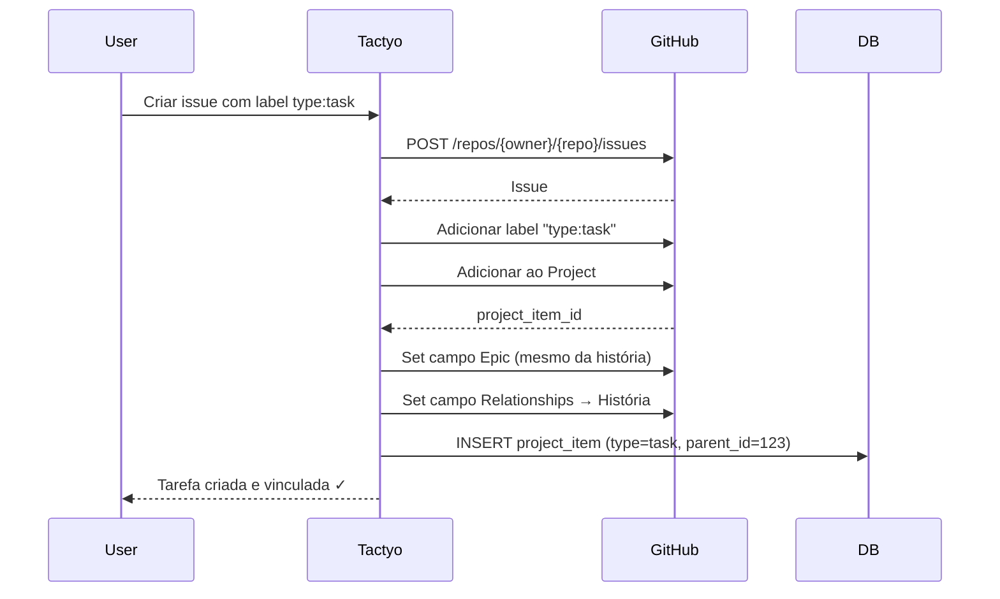
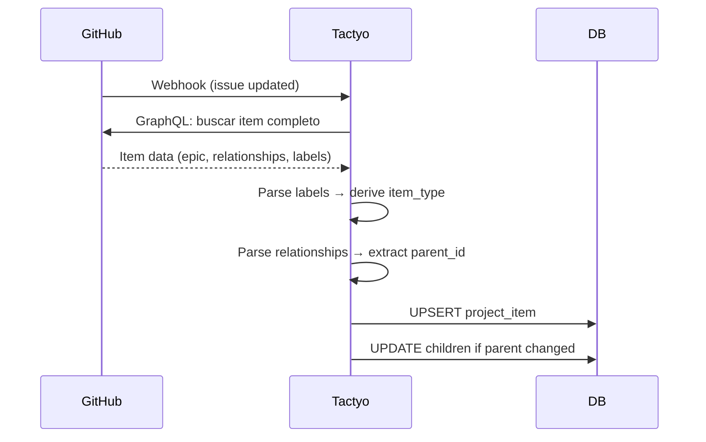

# Design: Hierarquia Épico → História → Tarefa

**Versão:** 1.0
**Data:** 2025-10-08
**Status:** 📝 Draft

---

## 📋 Índice

1. [Visão Geral](#visão-geral)
2. [Definições](#definições)
3. [Arquitetura](#arquitetura)
4. [Estrutura no GitHub Projects](#estrutura-no-github-projects)
5. [API GraphQL](#api-graphql)
6. [Modelo de Dados (Backend)](#modelo-de-dados-backend)
7. [Endpoints REST](#endpoints-rest)
8. [Fluxos de Trabalho](#fluxos-de-trabalho)
9. [Interface do Usuário](#interface-do-usuário)
10. [Visualização com React Flow](#visualização-com-react-flow)
11. [Migração de Dados](#migração-de-dados)
12. [Casos de Uso](#casos-de-uso)
13. [Referências](#referências)

---

## Visão Geral

### Objetivo

Implementar uma estrutura hierárquica de três níveis no Tactyo para organizar trabalho seguindo metodologias ágeis:

```
📦 Épico (Epic)
  └── 📖 História (Story)
      └── ✅ Tarefa (Task/Feature/Bug)
```

### Princípios

1. **Native-first**: Usar recursos nativos do GitHub Projects V2 sempre que possível
2. **Bidirectional**: Mudanças podem ser feitas tanto no Tactyo quanto no GitHub
3. **Visual**: Suportar visualizações hierárquicas e em grafo
4. **Flexible**: Permitir trabalho sem hierarquia completa (tarefas diretas)

---

## Definições

### 1. Épico (Epic)

**O que é:**
- Agrupamento macro de trabalho relacionado
- Geralmente representa uma funcionalidade grande ou tema
- Pode durar múltiplos sprints

**Implementação:**
- **Custom Field** no GitHub Projects: `Epic` (tipo: SingleSelect)
- Cada opção representa um épico diferente
- Propriedades de cada opção:
  - `id`: ID da opção no GitHub
  - `name`: Nome do épico (ex: "Autenticação", "Dashboard")
  - `color`: Cor visual (hex) para UI
  - `description`: Descrição detalhada do épico

**Gerenciamento:**
- CRUD completo pelo Tactyo
- Sincronização bidirecional com GitHub Projects
- Não é uma Issue, apenas um campo classificador

**Exemplos:**
- "Sistema de Autenticação"
- "Dashboard Analytics"
- "Integrações GitHub"
- "Infraestrutura"

---

### 2. História (Story)

**O que é:**
- Unidade de funcionalidade que entrega valor ao usuário
- Pode ser quebrada em múltiplas tarefas menores
- Geralmente completada em 1 sprint

**Implementação:**
- **Issue do GitHub** com prefixo `HISTORY:` no título
- Label obrigatória: `type:story`
- Campo `Epic`: associa a história a um épico
- Campo `Relationships`: vazio (histórias não apontam para outras issues)

**Formato do Título:**
```
HISTORY: [descrição clara do que será entregue]
```

**Exemplos:**
- `HISTORY: Implementar login com email e senha`
- `HISTORY: Criar dashboard de métricas de sprint`
- `HISTORY: Integrar webhooks do GitHub`

**Labels adicionais (opcionais):**
- Priority: `priority:high`, `priority:medium`, `priority:low`
- Status via GitHub Projects field

---

### 3. Tarefa/Feature/Bug (Task)

**O que é:**
- Unidade atômica de trabalho
- Implementação específica e técnica
- Geralmente completada em < 1 dia

**Implementação:**
- **Issue do GitHub** normal (sem prefixo HISTORY:)
- Label de tipo obrigatória:
  - `type:task` - tarefa geral
  - `type:feature` - nova funcionalidade
  - `type:bug` - correção de defeito
- Campo `Epic`: associa diretamente a um épico
- Campo `Relationships`: aponta para a História pai (quando aplicável)

**Exemplos:**
- `Criar endpoint POST /api/auth/login` (type:task)
- `Implementar OAuth2 com Google` (type:feature)
- `Corrigir erro 500 ao fazer logout` (type:bug)

---

## Arquitetura

### Hierarquia Flexível

```
┌─────────────────────────────────────────────────────┐
│                                                     │
│  NÍVEL 1: Épico (Custom Field)                     │
│  ┌──────────────────────────────────────────────┐  │
│  │ Epic: "Autenticação"                         │  │
│  │ - Color: #FF6B6B                             │  │
│  │ - Description: Sistema completo de auth      │  │
│  └──────────────────────────────────────────────┘  │
│         ▼                                           │
│  NÍVEL 2: Histórias (Issues com HISTORY:)          │
│  ┌──────────────────────────────────────────────┐  │
│  │ Issue #123: HISTORY: Login com email/senha  │  │
│  │ - Epic: Autenticação                         │  │
│  │ - Label: type:story                          │  │
│  └──────────────────────────────────────────────┘  │
│         ▼                                           │
│  NÍVEL 3: Tarefas (Issues normais)                 │
│  ┌──────────────────────────────────────────────┐  │
│  │ Issue #124: Criar endpoint POST /login      │  │
│  │ - Epic: Autenticação                         │  │
│  │ - Relationships: #123                        │  │
│  │ - Label: type:task                           │  │
│  └──────────────────────────────────────────────┘  │
│  ┌──────────────────────────────────────────────┐  │
│  │ Issue #125: Implementar validação JWT       │  │
│  │ - Epic: Autenticação                         │  │
│  │ - Relationships: #123                        │  │
│  │ - Label: type:feature                        │  │
│  └──────────────────────────────────────────────┘  │
│                                                     │
└─────────────────────────────────────────────────────┘
```

### Cenários Suportados

1. **Hierarquia completa**: Épico > História > Tarefa
2. **História sem tarefas**: Épico > História (trabalho simples)
3. **Tarefa direta**: Épico > Tarefa (sem história, trabalho pontual)
4. **Sem épico**: História ou Tarefa sem épico (edge case, permitido)

---

## Estrutura no GitHub Projects

### Custom Fields Necessários

#### 1. Epic (SingleSelect)

```graphql
{
  id: "PVTSSF_..."
  name: "Epic"
  dataType: SINGLE_SELECT
  options: [
    {
      id: "option_1"
      name: "Autenticação"
      color: PINK
      description: "Sistema de autenticação e autorização"
    },
    {
      id: "option_2"
      name: "Dashboard"
      color: BLUE
      description: "Dashboards e visualizações"
    }
  ]
}
```

**Criação via API:**
```graphql
mutation CreateEpicField($projectId: ID!) {
  createProjectV2Field(input: {
    projectId: $projectId
    dataType: SINGLE_SELECT
    name: "Epic"
  }) {
    projectV2Field {
      ... on ProjectV2SingleSelectField {
        id
        name
        options {
          id
          name
          color
          description
        }
      }
    }
  }
}
```

#### 2. Relationships Field (já existe ou criar)

```graphql
{
  id: "PVTF_..."
  name: "História" (ou "Parent Story")
  dataType: PROJECT_V2_ITEM
}
```

**Criação via API:**
```graphql
mutation CreateRelationshipsField($projectId: ID!) {
  createProjectV2Field(input: {
    projectId: $projectId
    dataType: PROJECT_V2_ITEM
    name: "História"
  }) {
    projectV2Field {
      ... on ProjectV2Field {
        id
        name
      }
    }
  }
}
```

### Labels do GitHub

Labels padrão a serem criadas no repositório:

| Label | Color | Description |
|-------|-------|-------------|
| `type:story` | `#7057ff` | História (issue com prefixo HISTORY:) |
| `type:task` | `#0e8a16` | Tarefa geral |
| `type:feature` | `#1d76db` | Nova funcionalidade |
| `type:bug` | `#d73a4a` | Correção de bug |

**Criação via API REST:**
```bash
POST /repos/{owner}/{repo}/labels
{
  "name": "type:story",
  "color": "7057ff",
  "description": "História (issue com prefixo HISTORY:)"
}
```

---

## API GraphQL

### 1. Listar Opções de Épicos

```graphql
query GetEpicOptions($projectId: ID!) {
  node(id: $projectId) {
    ... on ProjectV2 {
      fields(first: 20) {
        nodes {
          ... on ProjectV2SingleSelectField {
            id
            name
            options {
              id
              name
              color
              description
            }
          }
        }
      }
    }
  }
}
```

**Filtrar apenas campo Epic:**
```python
epic_field = next(
    (f for f in fields
     if f.get('name') == 'Epic'
     and f.get('__typename') == 'ProjectV2SingleSelectField'),
    None
)
```

---

### 2. Criar Opção de Épico

```graphql
mutation CreateEpicOption(
  $fieldId: ID!
  $name: String!
  $color: ProjectV2SingleSelectFieldOptionColor!
  $description: String!
) {
  updateProjectV2Field(input: {
    fieldId: $fieldId
    singleSelectOptions: {
      add: [{
        name: $name
        color: $color
        description: $description
      }]
    }
  }) {
    projectV2Field {
      ... on ProjectV2SingleSelectField {
        id
        options {
          id
          name
          color
          description
        }
      }
    }
  }
}
```

**Cores disponíveis:**
```
GRAY, BLUE, GREEN, YELLOW, ORANGE, RED, PINK, PURPLE
```

---

### 3. Atualizar Opção de Épico

```graphql
mutation UpdateEpicOption(
  $fieldId: ID!
  $optionId: String!
  $name: String!
  $color: ProjectV2SingleSelectFieldOptionColor!
  $description: String!
) {
  updateProjectV2Field(input: {
    fieldId: $fieldId
    singleSelectOptions: {
      update: [{
        optionId: $optionId
        name: $name
        color: $color
        description: $description
      }]
    }
  }) {
    projectV2Field {
      ... on ProjectV2SingleSelectField {
        id
        options {
          id
          name
          color
          description
        }
      }
    }
  }
}
```

---

### 4. Deletar Opção de Épico

```graphql
mutation DeleteEpicOption(
  $fieldId: ID!
  $optionId: String!
) {
  updateProjectV2Field(input: {
    fieldId: $fieldId
    singleSelectOptions: {
      delete: [$optionId]
    }
  }) {
    projectV2Field {
      ... on ProjectV2SingleSelectField {
        id
        options {
          id
          name
        }
      }
    }
  }
}
```

**⚠️ Atenção:**
- Deletar um épico NÃO deleta as issues associadas
- Issues perdem o valor do campo Epic (fica null)
- Considerar confirmação com lista de issues afetadas

---

### 5. Atribuir Épico a um Item

```graphql
mutation SetItemEpic(
  $projectId: ID!
  $itemId: ID!
  $fieldId: ID!
  $optionId: String!
) {
  updateProjectV2ItemFieldValue(input: {
    projectId: $projectId
    itemId: $itemId
    fieldId: $fieldId
    value: {
      singleSelectOptionId: $optionId
    }
  }) {
    projectV2Item {
      id
      fieldValueByName(name: "Epic") {
        ... on ProjectV2ItemFieldSingleSelectValue {
          name
          color
          description
        }
      }
    }
  }
}
```

---

### 6. Criar Relacionamento (História → Tarefa)

```graphql
mutation LinkTaskToStory(
  $projectId: ID!
  $itemId: ID!         # ID do project item da TAREFA
  $fieldId: ID!        # ID do campo Relationships
  $storyItemId: ID!    # ID do project item da HISTÓRIA
) {
  updateProjectV2ItemFieldValue(input: {
    projectId: $projectId
    itemId: $itemId
    fieldId: $fieldId
    value: {
      projectV2ItemIds: [$storyItemId]
    }
  }) {
    projectV2Item {
      id
      fieldValueByName(name: "História") {
        ... on ProjectV2ItemFieldProjectV2ItemValue {
          items {
            id
            content {
              ... on Issue {
                number
                title
              }
            }
          }
        }
      }
    }
  }
}
```

---

### 7. Listar Items com Hierarquia

```graphql
query GetProjectItemsWithHierarchy(
  $projectId: ID!
  $first: Int!
  $after: String
) {
  node(id: $projectId) {
    ... on ProjectV2 {
      items(first: $first, after: $after) {
        pageInfo {
          hasNextPage
          endCursor
        }
        nodes {
          id
          content {
            ... on Issue {
              id
              number
              title
              url
              labels(first: 10) {
                nodes {
                  name
                  color
                }
              }
            }
          }
          fieldValueByName(name: "Epic") {
            ... on ProjectV2ItemFieldSingleSelectValue {
              optionId
              name
              color
              description
            }
          }
          fieldValueByName(name: "História") {
            ... on ProjectV2ItemFieldProjectV2ItemValue {
              items {
                id
                content {
                  ... on Issue {
                    number
                    title
                  }
                }
              }
            }
          }
          fieldValueByName(name: "Status") {
            ... on ProjectV2ItemFieldSingleSelectValue {
              name
            }
          }
        }
      }
    }
  }
}
```

---

## Modelo de Dados (Backend)

### Alterações na Tabela `project_item`

**Novos campos:**

```python
class ProjectItem(Base):
    # ... campos existentes ...

    # Tipo do item
    item_type: Mapped[str | None] = mapped_column(
        String(length=20),
        nullable=True,
        comment="story, task, feature, bug (derivado das labels)"
    )

    # Relacionamento pai (história)
    parent_item_id: Mapped[int | None] = mapped_column(
        Integer,
        ForeignKey("project_item.id", ondelete="SET NULL"),
        nullable=True,
        comment="ID do item pai (história) quando este é uma tarefa"
    )

    # Labels do GitHub
    labels: Mapped[list[dict] | None] = mapped_column(
        JSON,
        nullable=True,
        comment="Labels da issue no formato [{'name': 'type:task', 'color': '#0e8a16'}]"
    )

    # Relacionamentos ORM
    parent: Mapped["ProjectItem"] = relationship(
        "ProjectItem",
        remote_side="ProjectItem.id",
        back_populates="children"
    )

    children: Mapped[list["ProjectItem"]] = relationship(
        "ProjectItem",
        back_populates="parent",
        cascade="all, delete-orphan"
    )
```

**Migration:**
```python
# alembic/versions/20251008_05_add_hierarchy_fields.py

def upgrade() -> None:
    # Adicionar item_type
    op.add_column(
        "project_item",
        sa.Column("item_type", sa.String(length=20), nullable=True)
    )

    # Adicionar parent_item_id
    op.add_column(
        "project_item",
        sa.Column("parent_item_id", sa.Integer(), nullable=True)
    )

    # Adicionar labels JSON
    op.add_column(
        "project_item",
        sa.Column("labels", sa.JSON(), nullable=True)
    )

    # Criar FK para parent_item_id
    op.create_foreign_key(
        "fk_project_item_parent",
        "project_item",
        "project_item",
        ["parent_item_id"],
        ["id"],
        ondelete="SET NULL"
    )

    # Índices para performance
    op.create_index(
        "ix_project_item_type",
        "project_item",
        ["item_type"]
    )
    op.create_index(
        "ix_project_item_parent_id",
        "project_item",
        ["parent_item_id"]
    )
```

---

### Nova Tabela: `epic_option`

Cachear opções de épicos para performance e UI:

```python
class EpicOption(Base):
    __tablename__ = "epic_option"

    id: Mapped[int] = mapped_column(Integer, primary_key=True, autoincrement=True)
    project_id: Mapped[int] = mapped_column(
        Integer,
        ForeignKey("github_project.id", ondelete="CASCADE"),
        nullable=False
    )
    option_id: Mapped[str] = mapped_column(
        String(length=255),
        nullable=False,
        comment="ID da opção no GitHub (ex: option_xxx)"
    )
    name: Mapped[str] = mapped_column(
        String(length=255),
        nullable=False
    )
    color: Mapped[str] = mapped_column(
        String(length=20),
        nullable=False,
        comment="GRAY, BLUE, GREEN, etc"
    )
    description: Mapped[str | None] = mapped_column(
        String(length=1000),
        nullable=True
    )
    created_at: Mapped[datetime] = mapped_column(
        DateTime(timezone=True),
        server_default=func.now()
    )
    updated_at: Mapped[datetime] = mapped_column(
        DateTime(timezone=True),
        server_default=func.now(),
        onupdate=func.now()
    )

    # Relacionamento
    project = relationship("GithubProject", back_populates="epic_options")

    __table_args__ = (
        # Uma opção por projeto (sincronizado do GitHub)
        Index("ix_epic_option_project_option", "project_id", "option_id", unique=True),
    )
```

**Migration:**
```python
# alembic/versions/20251008_06_create_epic_option.py

def upgrade() -> None:
    op.create_table(
        "epic_option",
        sa.Column("id", sa.Integer(), autoincrement=True, nullable=False),
        sa.Column("project_id", sa.Integer(), nullable=False),
        sa.Column("option_id", sa.String(length=255), nullable=False),
        sa.Column("name", sa.String(length=255), nullable=False),
        sa.Column("color", sa.String(length=20), nullable=False),
        sa.Column("description", sa.String(length=1000), nullable=True),
        sa.Column(
            "created_at",
            sa.DateTime(timezone=True),
            server_default=sa.text("now()"),
            nullable=False
        ),
        sa.Column(
            "updated_at",
            sa.DateTime(timezone=True),
            server_default=sa.text("now()"),
            nullable=False
        ),
        sa.ForeignKeyConstraint(
            ["project_id"],
            ["github_project.id"],
            ondelete="CASCADE"
        ),
        sa.PrimaryKeyConstraint("id")
    )

    op.create_index(
        "ix_epic_option_project_option",
        "epic_option",
        ["project_id", "option_id"],
        unique=True
    )
```

---

## Endpoints REST

### Épicos (Epic Options)

#### `GET /api/projects/current/epics`

Lista todas as opções de épicos do projeto atual.

**Response:**
```json
{
  "field_id": "PVTSSF_lADOB...",
  "field_name": "Epic",
  "options": [
    {
      "id": "option_123",
      "name": "Autenticação",
      "color": "PINK",
      "description": "Sistema de autenticação e autorização",
      "items_count": 15
    },
    {
      "id": "option_456",
      "name": "Dashboard",
      "color": "BLUE",
      "description": "Dashboards e visualizações",
      "items_count": 8
    }
  ]
}
```

---

#### `POST /api/projects/current/epics`

Cria uma nova opção de épico.

**Request:**
```json
{
  "name": "Integrações",
  "color": "GREEN",
  "description": "Integrações com serviços externos"
}
```

**Response:**
```json
{
  "id": "option_789",
  "name": "Integrações",
  "color": "GREEN",
  "description": "Integrações com serviços externos"
}
```

---

#### `PATCH /api/projects/current/epics/{option_id}`

Atualiza uma opção de épico existente.

**Request:**
```json
{
  "name": "Integrações Externas",
  "color": "PURPLE",
  "description": "Integrações com APIs de terceiros (GitHub, Slack, etc)"
}
```

**Response:**
```json
{
  "id": "option_789",
  "name": "Integrações Externas",
  "color": "PURPLE",
  "description": "Integrações com APIs de terceiros (GitHub, Slack, etc)"
}
```

---

#### `DELETE /api/projects/current/epics/{option_id}`

Remove uma opção de épico.

**Query params:**
- `force=true` - Confirma remoção mesmo com items associados

**Response (sem force, com items):**
```json
{
  "error": "cannot_delete_epic_with_items",
  "message": "Este épico tem 15 items associados",
  "affected_items": [
    {"id": 123, "title": "HISTORY: Login system"},
    {"id": 124, "title": "Create login endpoint"}
  ]
}
```

**Response (com force ou sem items):**
```json
{
  "success": true,
  "affected_items_count": 15
}
```

---

### Hierarquia de Items

#### `GET /api/projects/current/hierarchy`

Retorna estrutura hierárquica completa: Épico > História > Tarefas

**Query params:**
- `epic={option_id}` - Filtrar por épico específico
- `include_orphans=true` - Incluir items sem épico

**Response:**
```json
{
  "epics": [
    {
      "id": "option_123",
      "name": "Autenticação",
      "color": "PINK",
      "description": "Sistema de autenticação e autorização",
      "stories": [
        {
          "id": 456,
          "item_node_id": "PVTI_...",
          "issue_number": 123,
          "title": "HISTORY: Login com email e senha",
          "status": "In Progress",
          "url": "https://github.com/...",
          "tasks": [
            {
              "id": 457,
              "item_node_id": "PVTI_...",
              "issue_number": 124,
              "title": "Criar endpoint POST /login",
              "type": "task",
              "status": "Done",
              "assignees": ["user1"]
            },
            {
              "id": 458,
              "issue_number": 125,
              "title": "Implementar validação JWT",
              "type": "feature",
              "status": "In Progress"
            }
          ]
        }
      ],
      "direct_tasks": [
        {
          "id": 459,
          "issue_number": 126,
          "title": "Adicionar rate limiting",
          "type": "task",
          "status": "Todo"
        }
      ]
    }
  ],
  "orphans": {
    "stories": [],
    "tasks": []
  }
}
```

---

#### `POST /api/projects/current/items/{item_id}/link-story`

Vincula uma tarefa a uma história usando campo Relationships.

**Request:**
```json
{
  "story_item_id": 456
}
```

**Response:**
```json
{
  "id": 457,
  "parent_item_id": 456,
  "parent_story": {
    "id": 456,
    "issue_number": 123,
    "title": "HISTORY: Login com email e senha"
  }
}
```

---

#### `DELETE /api/projects/current/items/{item_id}/link-story`

Remove vínculo de uma tarefa com sua história.

**Response:**
```json
{
  "id": 457,
  "parent_item_id": null
}
```

---

### Labels

#### `POST /api/projects/current/setup/labels`

Cria labels padrão no repositório do projeto.

**Response:**
```json
{
  "created": [
    {"name": "type:story", "color": "7057ff"},
    {"name": "type:task", "color": "0e8a16"},
    {"name": "type:feature", "color": "1d76db"},
    {"name": "type:bug", "color": "d73a4a"}
  ],
  "existing": [
    {"name": "priority:high", "color": "ff0000"}
  ]
}
```

---

## Fluxos de Trabalho

### 1. Setup Inicial do Projeto



---

### 2. Criar Épico



---

### 3. Criar História



---

### 4. Criar Tarefa Vinculada a História



---

### 5. Sincronização (GitHub → Tactyo)



**Lógica de derivação de `item_type`:**
```python
def derive_item_type(labels: list[str], title: str) -> str:
    """Deriva o tipo do item baseado em labels e título."""
    label_names = {label['name'] for label in labels}

    # Verificar labels de tipo
    if 'type:story' in label_names:
        return 'story'
    elif 'type:task' in label_names:
        return 'task'
    elif 'type:feature' in label_names:
        return 'feature'
    elif 'type:bug' in label_names:
        return 'bug'

    # Fallback: verificar prefixo HISTORY:
    if title.startswith('HISTORY:'):
        return 'story'

    # Default
    return 'task'
```

---

## Interface do Usuário

### 1. Gerenciamento de Épicos

**Localização:** `/settings/epics`

**Componentes:**

```tsx
// EpicManager.tsx
interface Epic {
  id: string;
  name: string;
  color: string;
  description: string;
  items_count: number;
}

function EpicManager() {
  return (
    <div>
      <header>
        <h2>Gerenciar Épicos</h2>
        <Button onClick={openCreateDialog}>Novo Épico</Button>
      </header>

      <EpicList>
        {epics.map(epic => (
          <EpicCard key={epic.id}>
            <ColorBadge color={epic.color} />
            <h3>{epic.name}</h3>
            <p>{epic.description}</p>
            <span>{epic.items_count} items</span>
            <Actions>
              <IconButton icon="edit" onClick={() => edit(epic)} />
              <IconButton icon="delete" onClick={() => deleteEpic(epic)} />
            </Actions>
          </EpicCard>
        ))}
      </EpicList>

      <CreateEpicDialog>
        <Input label="Nome" />
        <ColorPicker label="Cor" options={EPIC_COLORS} />
        <Textarea label="Descrição" />
      </CreateEpicDialog>
    </div>
  );
}
```

---

### 2. View Hierárquica (Backlog)

**Localização:** `/backlog` (modo hierárquico)

**Layout:**

```
┌─────────────────────────────────────────────────────┐
│  Backlog Hierárquico              [🔄] [📊] [⚙️]   │
├─────────────────────────────────────────────────────┤
│  Filtros:  [Epic ▼] [Status ▼] [🔍 Buscar]        │
├─────────────────────────────────────────────────────┤
│                                                     │
│  📦 Autenticação (15 items)               [expand] │
│  ├─ 📖 #123 HISTORY: Login com email/senha   [>]  │
│  │  ├─ ✅ #124 Criar endpoint POST /login   [✓]  │
│  │  ├─ ✅ #125 Implementar validação JWT    [⏳]  │
│  │  └─ ✅ #126 Adicionar testes unitários   [ ]  │
│  │                                                 │
│  ├─ 📖 #127 HISTORY: OAuth2 Google          [>]  │
│  │  ├─ ✅ #128 Setup OAuth credentials      [ ]  │
│  │  └─ ✅ #129 Implementar callback         [ ]  │
│  │                                                 │
│  └─ ✅ #130 Adicionar rate limiting         [✓]  │
│                                                     │
│  📦 Dashboard (8 items)                   [expand] │
│  └─ ...                                             │
│                                                     │
└─────────────────────────────────────────────────────┘
```

**Interações:**
- Click no épico: expand/collapse
- Click na história: expand/collapse tarefas
- Drag & drop: mover tarefa entre histórias
- Click direito: menu de contexto (editar, deletar, criar subtarefa)

---

### 3. Criação de Item (Modal)

```tsx
// CreateItemDialog.tsx
interface CreateItemProps {
  defaultEpic?: string;
  defaultParent?: number; // story_id se criar tarefa
}

function CreateItemDialog({ defaultEpic, defaultParent }: CreateItemProps) {
  const [itemType, setItemType] = useState<'story' | 'task' | 'feature' | 'bug'>('task');

  return (
    <Dialog>
      <DialogHeader>Criar Item</DialogHeader>

      <DialogContent>
        {/* Tipo */}
        <RadioGroup value={itemType} onChange={setItemType}>
          <Radio value="story">📖 História</Radio>
          <Radio value="task">✅ Tarefa</Radio>
          <Radio value="feature">⭐ Feature</Radio>
          <Radio value="bug">🐛 Bug</Radio>
        </RadioGroup>

        {/* Título */}
        <Input
          label="Título"
          placeholder={
            itemType === 'story'
              ? "HISTORY: Implementar..."
              : "Criar endpoint..."
          }
          prefix={itemType === 'story' ? 'HISTORY: ' : ''}
        />

        {/* Descrição */}
        <Textarea label="Descrição" rows={4} />

        {/* Épico */}
        <Select label="Épico" defaultValue={defaultEpic}>
          {epics.map(epic => (
            <Option key={epic.id} value={epic.id}>
              <ColorBadge color={epic.color} />
              {epic.name}
            </Option>
          ))}
        </Select>

        {/* História (apenas se type !== story) */}
        {itemType !== 'story' && (
          <Select
            label="História (opcional)"
            defaultValue={defaultParent}
            nullable
          >
            {stories.map(story => (
              <Option key={story.id} value={story.id}>
                #{story.issue_number} {story.title}
              </Option>
            ))}
          </Select>
        )}

        {/* Assignees, Sprint, etc */}
      </DialogContent>

      <DialogFooter>
        <Button variant="secondary" onClick={close}>Cancelar</Button>
        <Button onClick={createItem}>Criar</Button>
      </DialogFooter>
    </Dialog>
  );
}
```

---

## Visualização com React Flow

### Instalação

```bash
npm install reactflow
```

### Componente Principal

```tsx
// HierarchyGraph.tsx
import ReactFlow, {
  Node,
  Edge,
  Background,
  Controls,
  MiniMap,
} from 'reactflow';
import 'reactflow/dist/style.css';

interface HierarchyGraphProps {
  epic_id?: string;
}

function HierarchyGraph({ epic_id }: HierarchyGraphProps) {
  const { data } = useHierarchy({ epic_id });

  const { nodes, edges } = useMemo(() => {
    return buildGraphFromHierarchy(data);
  }, [data]);

  return (
    <div style={{ width: '100%', height: '600px' }}>
      <ReactFlow
        nodes={nodes}
        edges={edges}
        nodeTypes={nodeTypes}
        fitView
      >
        <Background />
        <Controls />
        <MiniMap />
      </ReactFlow>
    </div>
  );
}
```

---

### Construção do Grafo

```tsx
// buildGraphFromHierarchy.ts
import { Node, Edge } from 'reactflow';
import dagre from 'dagre';

function buildGraphFromHierarchy(data: HierarchyData): { nodes: Node[], edges: Edge[] } {
  const nodes: Node[] = [];
  const edges: Edge[] = [];

  let nodeId = 0;

  // Nível 1: Épicos
  data.epics.forEach((epic, epicIndex) => {
    const epicNodeId = `epic-${epic.id}`;

    nodes.push({
      id: epicNodeId,
      type: 'epic',
      data: {
        label: epic.name,
        color: epic.color,
        description: epic.description,
        items_count: epic.stories.length + epic.direct_tasks.length,
      },
      position: { x: 0, y: epicIndex * 200 }, // será ajustado pelo layout
    });

    // Nível 2: Histórias
    epic.stories.forEach((story, storyIndex) => {
      const storyNodeId = `story-${story.id}`;

      nodes.push({
        id: storyNodeId,
        type: 'story',
        data: {
          label: story.title,
          issue_number: story.issue_number,
          status: story.status,
          url: story.url,
        },
        position: { x: 0, y: 0 },
      });

      edges.push({
        id: `${epicNodeId}-${storyNodeId}`,
        source: epicNodeId,
        target: storyNodeId,
        type: 'smoothstep',
      });

      // Nível 3: Tarefas da história
      story.tasks.forEach((task) => {
        const taskNodeId = `task-${task.id}`;

        nodes.push({
          id: taskNodeId,
          type: 'task',
          data: {
            label: task.title,
            issue_number: task.issue_number,
            type: task.type,
            status: task.status,
          },
          position: { x: 0, y: 0 },
        });

        edges.push({
          id: `${storyNodeId}-${taskNodeId}`,
          source: storyNodeId,
          target: taskNodeId,
          type: 'smoothstep',
        });
      });
    });

    // Tarefas diretas do épico (sem história)
    epic.direct_tasks.forEach((task) => {
      const taskNodeId = `task-${task.id}`;

      nodes.push({
        id: taskNodeId,
        type: 'task',
        data: {
          label: task.title,
          issue_number: task.issue_number,
          type: task.type,
          status: task.status,
        },
        position: { x: 0, y: 0 },
      });

      edges.push({
        id: `${epicNodeId}-${taskNodeId}`,
        source: epicNodeId,
        target: taskNodeId,
        type: 'smoothstep',
        style: { strokeDasharray: '5,5' }, // linha tracejada
      });
    });
  });

  // Aplicar layout automático (dagre)
  return applyDagreLayout(nodes, edges);
}
```

---

### Layout Automático (Dagre)

```tsx
// dagreLayout.ts
import dagre from 'dagre';
import { Node, Edge } from 'reactflow';

function applyDagreLayout(
  nodes: Node[],
  edges: Edge[],
  direction: 'TB' | 'LR' = 'TB'
): { nodes: Node[], edges: Edge[] } {
  const dagreGraph = new dagre.graphlib.Graph();
  dagreGraph.setDefaultEdgeLabel(() => ({}));
  dagreGraph.setGraph({ rankdir: direction });

  // Node sizes
  const nodeSizes = {
    epic: { width: 250, height: 80 },
    story: { width: 300, height: 60 },
    task: { width: 280, height: 50 },
  };

  nodes.forEach((node) => {
    const size = nodeSizes[node.type as keyof typeof nodeSizes] || { width: 200, height: 50 };
    dagreGraph.setNode(node.id, size);
  });

  edges.forEach((edge) => {
    dagreGraph.setEdge(edge.source, edge.target);
  });

  dagre.layout(dagreGraph);

  // Aplicar posições calculadas
  const layoutedNodes = nodes.map((node) => {
    const nodeWithPosition = dagreGraph.node(node.id);
    return {
      ...node,
      position: {
        x: nodeWithPosition.x - (nodeSizes[node.type as keyof typeof nodeSizes]?.width || 200) / 2,
        y: nodeWithPosition.y - (nodeSizes[node.type as keyof typeof nodeSizes]?.height || 50) / 2,
      },
    };
  });

  return { nodes: layoutedNodes, edges };
}
```

---

### Custom Nodes

```tsx
// EpicNode.tsx
import { Handle, Position } from 'reactflow';

function EpicNode({ data }: { data: any }) {
  return (
    <div className="epic-node">
      <Handle type="target" position={Position.Top} />

      <div className="epic-header" style={{ background: data.color }}>
        📦 ÉPICO
      </div>

      <div className="epic-content">
        <h3>{data.label}</h3>
        <p className="description">{data.description}</p>
        <span className="badge">{data.items_count} items</span>
      </div>

      <Handle type="source" position={Position.Bottom} />
    </div>
  );
}

// StoryNode.tsx
function StoryNode({ data }: { data: any }) {
  return (
    <div className="story-node">
      <Handle type="target" position={Position.Top} />

      <div className="story-header">
        📖 HISTÓRIA #{data.issue_number}
      </div>

      <div className="story-content">
        <p>{data.label}</p>
        <StatusBadge status={data.status} />
      </div>

      <Handle type="source" position={Position.Bottom} />
    </div>
  );
}

// TaskNode.tsx
function TaskNode({ data }: { data: any }) {
  const icon = {
    task: '✅',
    feature: '⭐',
    bug: '🐛',
  }[data.type] || '✅';

  return (
    <div className={`task-node task-${data.type}`}>
      <Handle type="target" position={Position.Top} />

      <div className="task-content">
        <span className="icon">{icon}</span>
        <p>#{data.issue_number} {data.label}</p>
        <StatusBadge status={data.status} />
      </div>
    </div>
  );
}

const nodeTypes = {
  epic: EpicNode,
  story: StoryNode,
  task: TaskNode,
};
```

---

### Estilos CSS

```css
/* hierarchyGraph.css */

.epic-node {
  min-width: 250px;
  background: white;
  border: 2px solid #e5e7eb;
  border-radius: 8px;
  box-shadow: 0 4px 6px rgba(0, 0, 0, 0.1);
}

.epic-header {
  padding: 8px 12px;
  font-size: 12px;
  font-weight: 600;
  color: white;
  border-radius: 6px 6px 0 0;
  text-align: center;
}

.epic-content {
  padding: 12px;
}

.epic-content h3 {
  margin: 0 0 8px 0;
  font-size: 16px;
}

.epic-content .description {
  font-size: 13px;
  color: #6b7280;
  margin-bottom: 8px;
}

.epic-content .badge {
  background: #f3f4f6;
  padding: 4px 8px;
  border-radius: 12px;
  font-size: 12px;
}

.story-node {
  min-width: 300px;
  background: white;
  border: 2px solid #7057ff;
  border-radius: 6px;
  box-shadow: 0 2px 4px rgba(0, 0, 0, 0.08);
}

.story-header {
  background: #7057ff;
  color: white;
  padding: 6px 10px;
  font-size: 11px;
  font-weight: 600;
  border-radius: 4px 4px 0 0;
}

.story-content {
  padding: 10px;
}

.story-content p {
  margin: 0 0 6px 0;
  font-size: 14px;
}

.task-node {
  min-width: 280px;
  background: white;
  border: 2px solid #d1d5db;
  border-radius: 6px;
  padding: 8px 12px;
}

.task-node.task-feature {
  border-color: #1d76db;
}

.task-node.task-bug {
  border-color: #d73a4a;
}

.task-content {
  display: flex;
  align-items: center;
  gap: 8px;
}

.task-content .icon {
  font-size: 18px;
}

.task-content p {
  margin: 0;
  font-size: 13px;
  flex: 1;
}
```

---

## Migração de Dados

### Script de Migração

Converter dados existentes para nova estrutura:

```python
# scripts/migrate_to_hierarchy.py

import asyncio
from sqlalchemy import select, update
from app.db.session import SessionLocal
from app.models.project_item import ProjectItem


async def migrate():
    """
    Migração de dados existentes:
    1. Deriva item_type das labels
    2. Identifica histórias pelo prefixo HISTORY:
    3. Vincula tarefas a histórias quando possível
    """
    async with SessionLocal() as db:
        # Buscar todos os items
        stmt = select(ProjectItem)
        result = await db.execute(stmt)
        items = result.scalars().all()

        print(f"📊 Migrando {len(items)} items...")

        stories = []
        tasks = []

        for item in items:
            # Deriva item_type
            item_type = derive_item_type(item.labels or [], item.title or "")
            item.item_type = item_type

            if item_type == 'story':
                stories.append(item)
            else:
                tasks.append(item)

        print(f"📖 {len(stories)} histórias identificadas")
        print(f"✅ {len(tasks)} tarefas identificadas")

        # Tentar vincular tarefas a histórias pelo epic
        linked = 0
        for task in tasks:
            if not task.epic_name:
                continue

            # Buscar histórias do mesmo épico
            matching_stories = [
                s for s in stories
                if s.epic_name == task.epic_name
            ]

            if matching_stories:
                # Vincular à primeira história (heurística simples)
                task.parent_item_id = matching_stories[0].id
                linked += 1

        print(f"🔗 {linked} tarefas vinculadas a histórias")

        await db.commit()
        print("✅ Migração concluída!")


if __name__ == "__main__":
    asyncio.run(migrate())
```

**Executar:**
```bash
cd api
source venv/bin/activate
python scripts/migrate_to_hierarchy.py
```

---

## Casos de Uso

### Caso 1: Criar Épico e Estrutura Completa

**Cenário:**
PM quer organizar o trabalho de um novo módulo "Sistema de Notificações"

**Passos:**

1. **Criar Épico**
   ```bash
   POST /api/projects/current/epics
   {
     "name": "Sistema de Notificações",
     "color": "ORANGE",
     "description": "Notificações push, email e in-app"
   }
   ```

2. **Criar História 1**
   ```bash
   POST /repos/{owner}/{repo}/issues
   {
     "title": "HISTORY: Notificações por email",
     "body": "Implementar envio de notificações via SMTP",
     "labels": ["type:story"]
   }
   # Depois: atribuir épico via Tactyo
   ```

3. **Criar Tarefas da História**
   ```bash
   # Tarefa 1
   POST /repos/{owner}/{repo}/issues
   {
     "title": "Configurar servidor SMTP",
     "labels": ["type:task"]
   }
   # Vincular à história via Relationships field

   # Tarefa 2
   POST /repos/{owner}/{repo}/issues
   {
     "title": "Criar templates de email",
     "labels": ["type:feature"]
   }
   ```

**Resultado:**
```
📦 Sistema de Notificações
  └── 📖 HISTORY: Notificações por email
      ├── ✅ Configurar servidor SMTP
      └── ⭐ Criar templates de email
```

---

### Caso 2: Visualizar Épico no Grafo

**Cenário:**
Desenvolvedor quer ver todas as histórias e tarefas do épico "Autenticação"

**Passos:**

1. Acessar `/backlog?view=graph&epic=option_123`
2. React Flow renderiza grafo hierárquico
3. Click em nó para ver detalhes
4. Drag & drop para reordenar

**Interações:**
- Zoom in/out
- Pan (arrastar canvas)
- Click em edge para ver relação
- Double-click em story node para expandir tarefas

---

### Caso 3: Mover Tarefa para Outra História

**Cenário:**
Durante refinement, equipe decide que uma tarefa pertence a outra história

**Passos:**

1. **Na UI hierárquica:**
   - Drag tarefa #125
   - Drop em outra história #130

2. **Backend:**
   ```bash
   POST /api/projects/current/items/125/link-story
   {
     "story_item_id": 130
   }
   ```

3. **GitHub Projects:**
   - Campo Relationships atualizado via GraphQL
   - Mantém mesmo épico (ou atualiza se necessário)

---

### Caso 4: Deletar Épico com Items

**Cenário:**
Épico "Experimento X" foi cancelado e precisa ser removido

**Passos:**

1. **Tentar deletar:**
   ```bash
   DELETE /api/projects/current/epics/option_999
   ```

2. **Resposta:**
   ```json
   {
     "error": "cannot_delete_epic_with_items",
     "affected_items_count": 12,
     "affected_items": [...]
   }
   ```

3. **Opções:**
   - **A:** Reatribuir items a outro épico antes de deletar
   - **B:** Deletar com force (items ficam sem épico)
   ```bash
   DELETE /api/projects/current/epics/option_999?force=true
   ```

---

## Referências

### GitHub API

- [Projects V2 GraphQL API](https://docs.github.com/en/graphql/reference/objects#projectv2)
- [Project V2 Fields](https://docs.github.com/en/issues/planning-and-tracking-with-projects/understanding-fields)
- [Relationships Field](https://docs.github.com/en/issues/planning-and-tracking-with-projects/understanding-fields/about-relationships-fields)
- [Labels API](https://docs.github.com/en/rest/issues/labels)

### Libraries

- [React Flow](https://reactflow.dev/)
- [Dagre Layout](https://github.com/dagrejs/dagre)
- [SQLAlchemy Relationships](https://docs.sqlalchemy.org/en/20/orm/basic_relationships.html)

### Padrões

- [User Story Mapping](https://www.jpattonassociates.com/user-story-mapping/)
- [Epic/Story/Task Hierarchy](https://www.atlassian.com/agile/project-management/epics-stories-themes)

---

## Próximos Passos

### Fase 1: Backend Core ✅
- [ ] Migration: adicionar campos hierárquicos
- [ ] Migration: criar tabela epic_option
- [ ] Endpoints CRUD de épicos
- [ ] Endpoint hierarchy GET
- [ ] Função deriva item_type de labels
- [ ] Sincronização bidirecional

### Fase 2: GitHub Integration ✅
- [ ] Criar/atualizar/deletar opções de épico via GraphQL
- [ ] Criar campo Relationships se não existir
- [ ] Criar labels padrão (type:*)
- [ ] Atualizar sincronização para capturar relationships

### Fase 3: Frontend Basic ✅
- [ ] Tela de gerenciamento de épicos (/settings/epics)
- [ ] Componente CreateItemDialog com tipo
- [ ] View hierárquica no backlog (lista)
- [ ] Filtros por épico

### Fase 4: Frontend Advanced ✅
- [ ] Integração react-flow
- [ ] Custom nodes (epic/story/task)
- [ ] Layout automático (dagre)
- [ ] Interações (drag, zoom, expand)

### Fase 5: Polish ✅
- [ ] Documentação de usuário
- [ ] Testes E2E de fluxos completos
- [ ] Performance (cache, lazy loading)
- [ ] Accessibility (ARIA labels)

---

**Documento criado por:** Tactyo Team
**Última atualização:** 2025-10-08
**Versão:** 1.0 (Draft)
